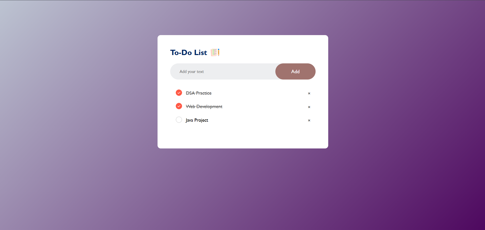

# 📝 To-Do List

A simple, intuitive, and responsive web-based To-Do List application to help you manage your daily tasks with ease.

## 🚀 Live Demo

Check it out here: [Live Demo](https://developer-krish.github.io/To-Do-List/)

## 📸 Screenshot



> *(Make sure you have an image named `screenshot.png` in the `images/` folder. If not, you can add a relevant screenshot or remove this section.)*

---

## ✨ Features

- ✅ Add new tasks
- ✏️ Edit tasks inline
- 📌 Mark tasks as completed
- 🗑️ Delete tasks individually
- 🔄 Clear all tasks at once
- 💾 Persistent data using `localStorage`
- 📱 Fully responsive for mobile and desktop

---

## 📦 Installation

To get a local copy up and running, follow these simple steps:

### 🔧 Clone the repository

```bash
git clone https://github.com/developer-krish/To-Do-List.git
```
🚀 Open the app
You can simply open index.html in your browser, or use a Live Server extension (like in VS Code) to serve it locally.

📌 Technologies Used
HTML5

CSS3

JavaScript (Vanilla JS)

LocalStorage API

🙌 Contributing
Contributions, issues, and feature requests are welcome!
Feel free to fork the repo and submit a pull request.
